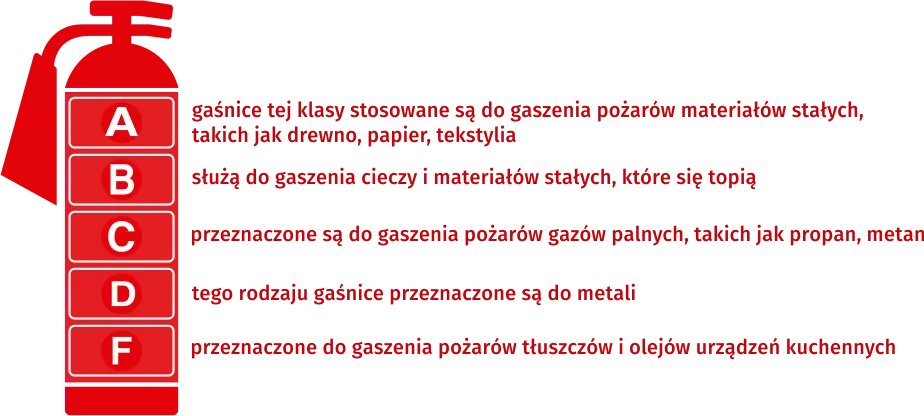
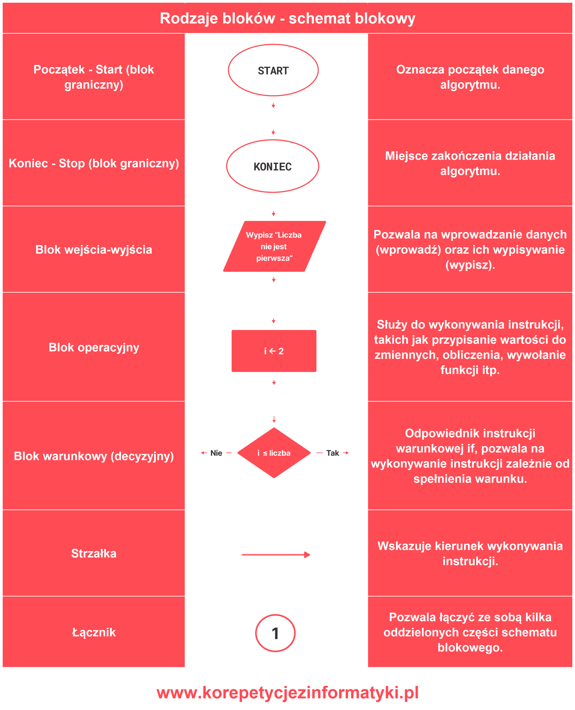
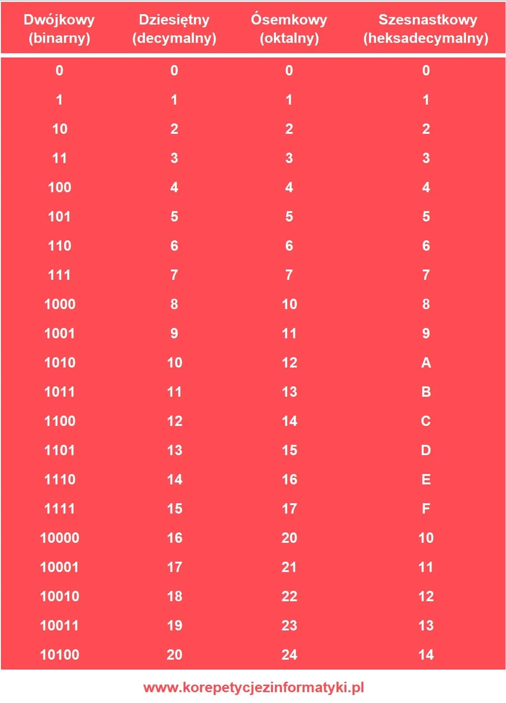
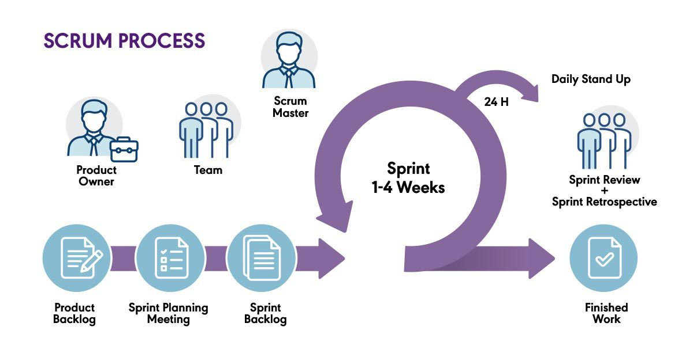
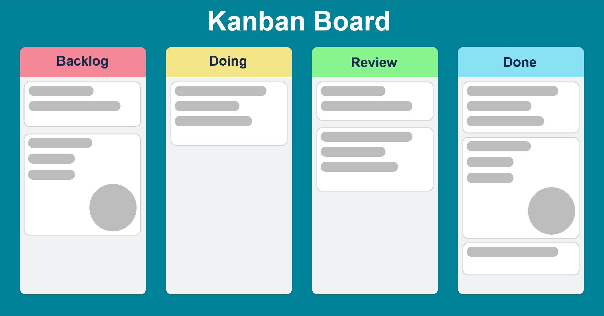
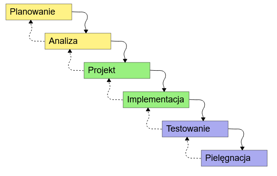
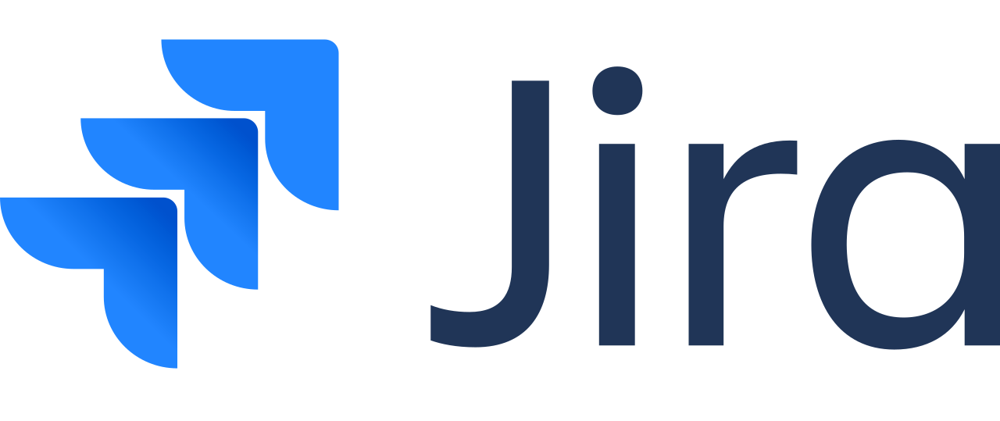
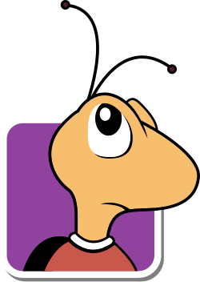

# Teoria

## Gaśnice

## Schematy blokowe

## Systemy liczbowe

## Metodologie

### Agile Scrum

### Agile Kanban

### Waterfall (kaskada)

### Porównanie

| Metoda | Czym jest | Sposób pracy | Zalety | Wady |
| --- | --- | --- | --- | --- |
| Agile Scrum | Framework Agile oparty na sprintach | Praca w cyklach 1–4 tygodnie, planowanie sprintu, daily, review, retro | Jasna struktura, regularne dostarczanie efektów, dobra kontrola postępu | Sporo spotkań, wymaga zaangażowanego zespołu |
| Agile Kanban | Framework Agile oparty na przepływie zadań | Zadania przesuwane na tablicy To Do / Doing / Done, bez sprintów | Elastyczność, prostota wdrożenia, dobra widoczność pracy | Mniej przewidywalne terminy, ryzyko chaosu bez limitów WIP |
| Waterfall | Klasyczny model sekwencyjny | Etapy realizowane po kolei: analiza → projekt → wdrożenie → testy | Przewidywalność, mocna dokumentacja, łatwe zarządzanie budżetem | Trudne zmiany w trakcie, produkt dopiero na końcu |

## Prawa autorskie

Prawa autorskie chronią twórcę utworu, np. programu komputerowego, grafiki, tekstu, muzyki, filmu lub dokumentacji technicznej. W informatyce mają duże znaczenie, ponieważ dotyczą zarówno kodu źródłowego, jak i elementów używanych w aplikacji.

Wyróżnia się dwa podstawowe rodzaje:

- autorskie prawa osobiste - chronią więź twórcy z utworem, np. prawo do oznaczenia autorstwa. Te prawa są niezbywalne.
- autorskie prawa majątkowe - dotyczą zarabiania na utworze i decydowania o jego rozpowszechnianiu; mogą zostać przeniesione lub licencjonowane. Te prawa wygasają po 70 latach od śmierci autora.

Ochrona praw autorskich często jest oznaczana symbolem ©.
Taki znak informuje, że utwór jest objęty prawami autorskimi i nie można go swobodnie kopiować ani wykorzystywać bez odpowiedniej podstawy prawnej, np. licencji.

Programista powinien sprawdzać licencje bibliotek, grafik, fontów i fragmentów kodu. Użycie cudzego zasobu bez zgody może naruszać prawo, nawet jeśli plik został znaleziony w Internecie.

### Programy

## Jira

Jira służy do zarządzania projektami, śledzenia błędów i wspierania pracy zespołów, w szczególności przy wykorzystaniu metodologii Agile: Scrum i Kanban.

## Bugzilla

Bugzilla służy do śledzenia błędów i monitorowania statusów projektów.

## WCAG 2.0

WCAG (Web Content Acessibility Guidelines) - wytyczne dotyczące dostępności stron internetowych i aplikacji mobilnych dla osób z niepełnosprawnościami.

1. Postrzegalność - ta zasada dotyczy zapewnienia, że treści są prezentowane w sposób łatwy do postrzegania przez użytkowników, niezależnie od ich zdolności percepcyjnych.

2. Funkcjonalność - zasada ta koncentruje się na zapewnieniu możliwości interakcji ze stroną internetową za pomocą różnych urządzeń wejściowych oraz oprogramowania asystującego.

3. Zrozumiałość - dotyczy ona zapewnienia czytelności i zrozumiałości treści oraz interakcji na stronie internetowej.

4. Kompatybilność - ta zasada wymaga zapewnienia kompatybilności ze różnymi technologiami asystującymi oraz różnymi przeglądarkami internetowymi.

## Normalizacja krajowa, normy krajowe, europejskie i międzynarodowe

### Normalizacja krajowa

Normalizacja krajowa to działalność polegająca na opracowywaniu i stosowaniu norm na poziomie państwa. Jej główne cele to:

- ujednolicanie wymagań technicznych dotyczących produktów, usług i procesów,
- poprawa jakości i bezpieczeństwa wyrobów,
- ochrona zdrowia, życia, środowiska i mienia,
- ułatwienie handlu oraz współpracy między firmami,
- usuwanie barier technicznych w handlu,
- wspieranie innowacji i rozwoju gospodarczego,
- zapewnienie kompatybilności produktów i systemów.

### Normy

Norma to dokument zatwierdzony przez uprawnioną jednostkę, zawierający zasady, wymagania lub wytyczne dotyczące produktów, usług, procesów albo metod działania. Cechy normy:

- jest ogólnie dostępna,
- została opracowana przez specjalistów,
- opiera się na uzgodnieniu (konsensusie),
- porządkuje wymagania techniczne,
- ułatwia zapewnienie jakości i bezpieczeństwa,
- jest dobrowolna (chyba że przepisy wymagają jej stosowania),
- może być aktualizowana.

### Oznaczenia norm: międzynarodowa, europejska, krajowa

| Rodzaj normy | Oznaczenie | Przykład | Znaczenie |
| --- | --- | --- | --- |
| Międzynarodowa | ISO, IEC | ISO 9001 | norma obowiązująca międzynarodowo |
| Europejska | EN | EN 71 | norma przyjęta w Europie |
| Polska / krajowa | PN | PN-B-02151 | Polska Norma |
| Polska wdrażająca EN | PN-EN | PN-EN 60204 | Polska wersja normy europejskiej |
| Polska wdrażająca ISO | PN-ISO | PN-ISO 14001 | Polska wersja normy ISO |

## Choroba zawodowa

Choroba zawodowa to stan zdrowotny spowodowany warunkami pracy lub czynnikami związanymi z wykonywaną profesją. Pracodawcy są zobowiązani do monitorowania warunków pracy i wdrażania rozwiązań minimalizujących ryzyko wystąpienia chorób zawodowych. Choroby na które narażeni są programiści:

- zespół cieśni nadgarstka
- bóle kręgosłupa
- wady wzroku

## Struktury danych

### Stos i kolejka

